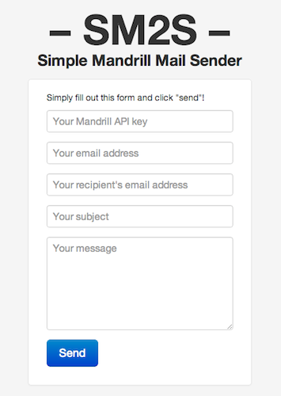

# SM2S – Simple Mandrill Mail Sender

Minimal javascript application which allows a user to send an email via the Mandrill API.

## Demo
You can see a live demo [here](http://vdurmont.github.com/SM2S). You need to have a Mandrill API key to send an email. It's free and easy!

## Resources
* [Mandrill](https://mandrill.com)
* [Mandrill API](https://mandrillapp.com/api/docs)
* [Bootstrap](http://twitter.github.com/bootstrap/)
